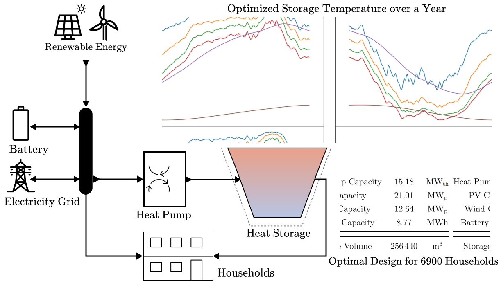
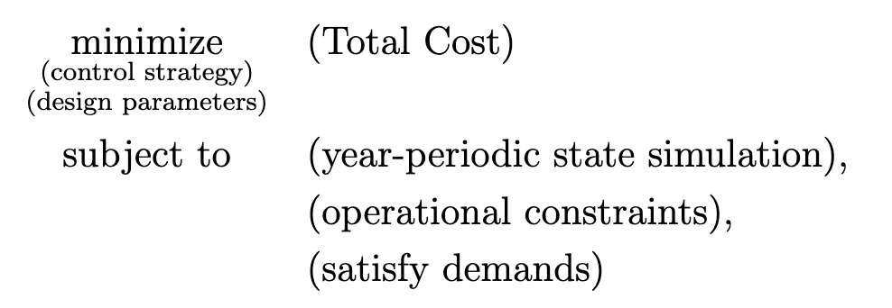

# NOSTES: A mini toolbox for the Simultaneous Design and Control Optimization of Seasonal Thermal Energy Storage Systems

by Wonsun Song, Jakob Harzer



This mini toolbox provides code for the optimzation of design parameters and control strategy for a seasonal thermal energy storage system. The system consists of renewable energy sources, that are connect to a short term storage (battery) and a long-term storage (thermal heat storage), and used to satisfy the demands of a large number of households.
Given this system, two key questions arise:
- For a given demand profile over a year, how should we control the energy flows?
- How should the system components be sized to minimize the running and investment costs?

This codes formulates and solves a nonlinear optimization problem to answer these questions. The optimal control problem that is solved is:



where the objective function is the sum of the running costs of the system over a year, and the constraints are the energy balances of the system, the capacity constraints of the components, and the control constraints.

For more details, please consider the below publication:

Related publication: [https://arxiv.org/abs/2501.07427](https://arxiv.org/abs/2501.07427)


## Getting started
For a simple example run the `dietenbach.py` file in the main directory:
```bash
python dietenbach_average.py
```
This will run the optimization for the Dietenbach case study of the paper using the example data provided in the data folder.
The results can then analyzed using the `plotResults.py` file in the main directory:
```bash
python plotResults.py
```


## Installation & Prerequisites
Required python packages:
- numpy
- casadi
- matplotlib
- typing
- tabulate

Tested with python 3.8, 3.11, 3.12

## Usage

The user provides a data file with the following entries (columns):
 - `T_amb`: ambient temperature [K (!)]
 - `P_pv`: power of the pv [W], of the installed capacity defined below
 - `P_wind`: power of the wind [W], of the installed capacity defined below
 - `P_load`: electric household power demand [W]
 - `Qdot_load`: heat demand of the household [W]

The user also has to provide the following default scaling parameters:
rough guesses for the sizes of the heatpump and battery,
and also the installed capacity PV and Wind of which the data is originating.

For example, for the provided dietenbach dataset:
```python
from utility import Constants
constants = Constants()
constants.C_bat_default = 2E7  # Wh
constants.C_hp_default = 2E7  # W (thermal)
constants.C_wind_default = 11.2 * 1e6  # Wp
constants.C_pv_default = 18.56 * 1e6  # Wp 
```
We provide an implementation of two different discretization schemes:
- Full Problem Discretization, all state dynamics are discretized with 1h steps, compare `dietenbach.py`: **Accurate, but slow**.
    ```python
    # build the system model
    systemmodel =  StratStorageModel(4, 2, 2, data = data, constants=constants)
    
    # build the NLP
    nlp = STESNLP(systemmodel, data)
    ```
- Average Problem Discretization, the inputs to the slow temperature dynamics are averaged over a day, reducing the problem size by ~2, compare `dietenbach_average.py`: **A bit less accurate, but significantly faster**.
    ```python
    # build the system model
    systemmodel = AveragedStratStorageModel(4, 2, 2, data=data, constants=constants)
    
    # build the NLP
    nlp = AverageSTESNLP(systemmodel, data)
    ```

## Authors and acknowledgment
This research was supported by DFG via project 525018088, by BMWK via 03EN3054B. We thank Manuel Kollmar, Armin Nurkanović, and Arne Groß for their help, guidance, and fruitful discussions.
